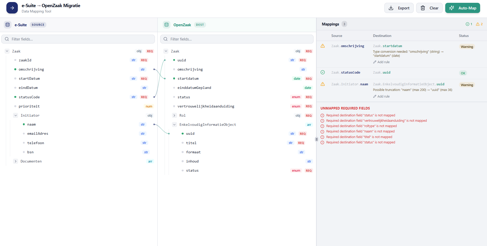

# Mapping Assistent Ontwerprichtlijnen

> Gegenereerd door `steer-design`. Verfijn dit document naarmate het ontwerpsysteem evolueert — niet opnieuw genereren vanaf nul.

Laatst bijgewerkt: 2026-04-16

## Ontwerpprincipes

1. **Visueel overzichtelijk** — De koppelingsworkspace moet in één oogopslag het volledige beeld geven: welke velden zijn gekoppeld, welke niet, en welke transformatieregels van toepassing zijn — zonder ergens anders naartoe te navigeren.
2. **Beheerder-first simplicity** — Elke UI-beslissing is geoptimaliseerd voor de werkwijze van de technisch beheerder. Vermijd onnodige opties, labels of interface-elementen die de koppelstaak niet ondersteunen.
3. **Alles op één pagina** — Alle kernfunctionaliteiten (bronschema, doelschema, koppelingscanvas, AI-suggesties) bestaan naast elkaar op één scherm. Navigatie tussen pagina's is de uitzondering, niet de norm.

## Ontwerpsysteem

- **Figma-bibliotheek:** Nog niet vastgesteld
- **Storybook:** Nog niet vastgesteld
- **Componentenbibliotheek:** PrimeVue (MIT)
- **Koppelingscanvas:** Vue Flow (MIT) — voor het tekenen van verbindingslijnen tussen bron- en doelvelden

## Tokens

> Te definiëren zodra het project is opgezet. Gebruik het thema-systeem van PrimeVue als basis voor de tokens.

## Componentpatronen

| Patroon | Component | Toelichting |
|---|---|---|
| Koppelingscanvas | Vue Flow | Bronknooppunten (links) ↔ doelknooppunten (rechts); verbindingen stellen veldkoppelingen voor |
| Schemaveldlijst | PrimeVue TreeTable of DataTable | Uitklapbare rijen voor geneste veldstructuren |
| Paneelopmaak | PrimeVue Splitter | Naast elkaar geplaatste panelen voor bronschema, canvas en doelschema |
| Uitklapbare secties | PrimeVue Accordion | Gebruikt voor het groeperen van velden, transformatieopties en AI-suggesties |
| AI-suggestiepaneel | Maatwerk (PrimeVue Card) | Toont suggestie, betrouwbaarheidsscore en bevestig-/afwijsacties |
| Slepen en neerzetten | PrimeVue Draggable | Bronvelden naar doelvelden slepen om koppelingen te maken |

## Vereiste UI-statussen

Elke interactieve functie moet de volgende statussen ondersteunen, tenzij expliciet uitgesloten:

- **Standaard** — de basisstatus
- **Laden** — asynchrone bewerking in uitvoering (schema ophalen, AI-suggestieverzoek)
- **Fout** — er is iets misgegaan (inline, niet in een modaal venster, tenzij gegevens verloren gaan)
- **Leeg** — nog geen velden gekoppeld, of schema nog niet geladen
- **Uitgeschakeld** — actie niet beschikbaar in de huidige context
- **Focus** — toetsenbordnavigatie actief (moet visueel herkenbaar zijn)

## Responsief gedrag

| Breekpunt | Breedte | Gedrag |
|---|---|---|
| Desktop | ≥ 1280px | Volledige driepanenopmaak (bron / canvas / doel) |

<!-- MANUAL ADDITIONS START -->
## Oriëntatieschets

De oriëntatieschets (`docs/design/orientation-design.png`) toont de beoogde UI en is de primaire visuele referentie voor de driepanenopmaak.

Wat de schets laat zien:
- **Linkerpaneel** — bronschema (e-Suite) als uitklapbare veldenboom; elk veld toont naam, datatype (str/num/obj/arr/date/enum) en REQ-badge voor verplichte velden
- **Middenpaneel** — doelschema (OpenZaak) met dezelfde opmaak; verbindingslijnen lopen van bronveld naar doelveld
- **Rechterpaneel** — mappingsoverzicht met actieve koppelingen, status (OK / Warning), transformatieregels en een sectie "Unmapped Required Fields"
- **Topbalk** — Export, Clear en Auto-Map acties
<!-- MANUAL ADDITIONS END -->
